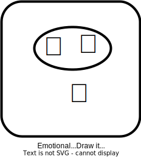

# README

## EmoDraw

### 简单介绍

基于jetpack compose和mlkit开发的一个android手写表情输入法app（同时支持mlkit所有手写输入的模型的识别）

> 这是我的大二课程Android技术开发基础(2022-2023学年第2学期）结课设计

### 功能展示

| 表情识别                      | 非语言模型                                   | 语言模型                                     | 偏好设置                                     |
| ----------------------------- | -------------------------------------------- | -------------------------------------------- | -------------------------------------------- |
|  |  |  |  |

